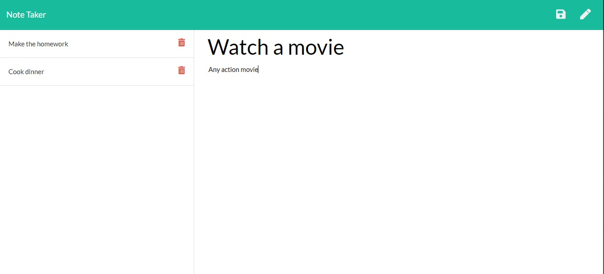

# note-taker

A node.js application providing an api to save and delete notes with persistance using storage in JSON file.

- [Deployed application link](#Deployed-application-link)
- [Screen shot](#Screen-shot)
- [Installation](#Installation)
- [Dependencies](#Dependencies)

## Deployed application link

[Click here to view the deployed application](https://radiant-reaches-19850.herokuapp.com/)

## Screen shot



## Installation

Clone the app repository then run the following command to install the app dependencies.

```sh
npm install
```

## Dependencies

The app uses the following node modules.

- Fs
- Express
- Path
